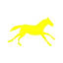
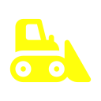

# LiteRaceOnline

Tron-like online multiplayer game with fun additional features.

The game runs entirely in the browser. Logic is authoritative on the server and broadcast to clients via Socket.IO.

## Features

- Real-time online multiplayer (up to 99 players per room — practical limit is much lower).
- Multiple rooms, password-protected, with join / create flow.
- Team play (up to 4 teams) or free-for-all.
- Two game modes:
  - **Bodycount** — each kill scores a point. First to N points wins.
  - **Survivor** — last rider (or last team) alive in the round scores. First to N points wins.
- Random pickup items that alter the game (see below).
- Self-contained server (Node + Express + Socket.IO) — no database required.
- Docker image available.

## Controls

The game is played with the keyboard.

| Key | Action |
|---|---|
| Arrow Left | Turn left |
| Arrow Right | Turn right |
| Arrow Up | (mode-dependent — used by certain items) |
| Arrow Down | (mode-dependent — used by certain items) |
| Spacebar | Trigger an "action" item |

## Items

Pickups appear on the arena during a round. Each item has a **type** (what it does) and a **scope** (whom it affects).

### Scopes

| Icon | Scope | Meaning |
|---|---|---|
|  | Player | Affects only the player who picked it up |
|  | All | Affects every rider in the round |
|  | Enemies | Affects every rider except the one who picked it up |
|  | Action | Picked up but triggered manually with Spacebar |

### Types

| Icon | Type | Effect |
|---|---|---|
|  | Speed Increase | Permanently increases speed |
|  | Speed Decrease | Permanently decreases speed |
|  | Boost | Temporary burst of speed (Spacebar) |
|  | Fast Turn | Sharper / faster turning |
|  | Jump | Briefly stops leaving a trail — you can fly over walls (Spacebar) |
|  | Invincibility | Cannot be killed for a short time |
|  | Bulldozer | Tears through walls instead of dying |
|  | Freeze | Enemies cannot turn for a short time |
|  | Compression | Shrinks the playable arena |
|  | Reset | Resets affected players' positions |
|  | Reset Reverse | Resets and reverses direction |
|  | Plus | Score bonus |
|  | Minus | Score penalty |
|  | Unknown | Randomly resolves to another item at pickup time |

Not every scope is valid for every type — for example, Freeze always targets enemies, Invincibility always targets the player, Compression always affects everyone.

## Tech stack

- **Server** — Node.js, Express, Socket.IO 2.x, TypeScript.
- **Client** — vanilla TypeScript compiled to JS, HTML5 `<canvas>`, Socket.IO client (loaded from CDN).
- No build tool beyond `tsc`.

## Project layout

```
ts/                 TypeScript sources (both server and client)
  server.ts         Authoritative server: game state, physics, scoring, items
  client.ts         Client networking / state sync
  clientRender.ts   Canvas rendering
  userInput.ts      Keyboard handling
  interface.ts      DOM / pages glue
  audio.ts          Sound effects
  teamData.ts       Team / color definitions
  displayStatus.ts  HUD
  geometry/         Point, segment, box, disc, literay (light-ray) primitives
  pages/            Welcome / setup / game page controllers
js/                 Compiled output of ts/ (produced by `tsc`)
css/                Stylesheet
img/                UI assets, item icons (scopes/ and types/), logo
sounds/             SFX
index.html          Single-page client
tsconfig.json       TypeScript compiler options
Dockerfile          Container image (Node 14, exposes port 13000)
```

## Installation

Requirements: Node.js (the Docker image uses Node 14.15.1) and a global `typescript` install for the build step.

```
$ npm install -g typescript
$ npm install
$ npm run build
$ npm start
```

Then open `http://localhost:<port>` in a browser. The default port is `13000` in deploy mode (overridable via the `PORT` environment variable) or `5500` when `DEPLOY` is set to `false` in `ts/server.ts`.

## Scripts

| Command | Purpose |
|---|---|
| `npm run build` | Compile TypeScript (`ts/` → `js/`) |
| `npm start` | Run the compiled server (`node js/server.js`) |
| `npm run dev` | Watch mode: `tsc -w` + `nodemon` on `js/server.js` (via `concurrently`) |

## Configuration

A few constants at the top of `ts/server.ts` control behavior:

- `PORT` / `DEPLOY` — listening port and whether to honor `process.env.PORT`.
- `STADIUM_W`, `STADIUM_H` — arena dimensions.
- `DURATION_PREPARE_SCREEN`, `DURATION_SCORES_SCREEN`, `DURATION_GAME_OVER_SCREEN` — UI timings (seconds).
- `FAST_TEST_ON`, `FAST_TEST_MODE`, `FAST_TEST_NB_PLAYERS`, `FAST_TEST_NB_TEAMS`, `FAST_TEST_NB_ROUNDS` — shortcuts to start a game instantly with fixed parameters during development.

## Docker

Build and run the provided image:

```
$ docker build -t literace-online .
$ docker run -p 13000:13000 literace-online
```

The image exposes port `13000` and starts `npm start`. To run in TypeScript watch / nodemon mode instead, uncomment the alternate `CMD` at the bottom of the `Dockerfile`.

## Gameplay flow

1. **Welcome page** — enter a name, then either join an existing room or create a new one (with a password).
2. **Setup page** — the room creator picks the number of points to win, the game mode (Bodycount / Survivor), and whether to use teams. Other players pick a color (and team if applicable) and mark themselves "ready". The creator then starts the game.
3. **Game page** — rounds run one after the other. Each round ends when a winner is determined (last alive, or all but one team eliminated). A score screen is shown between rounds. The first player or team to reach the target score wins the match.
